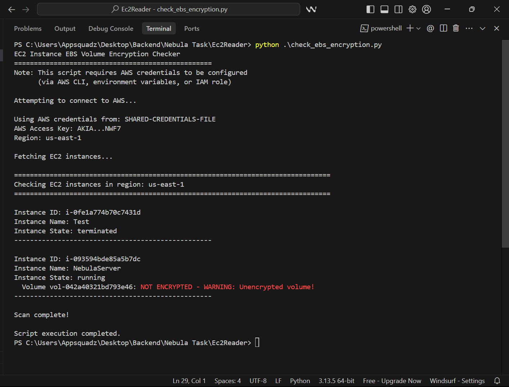
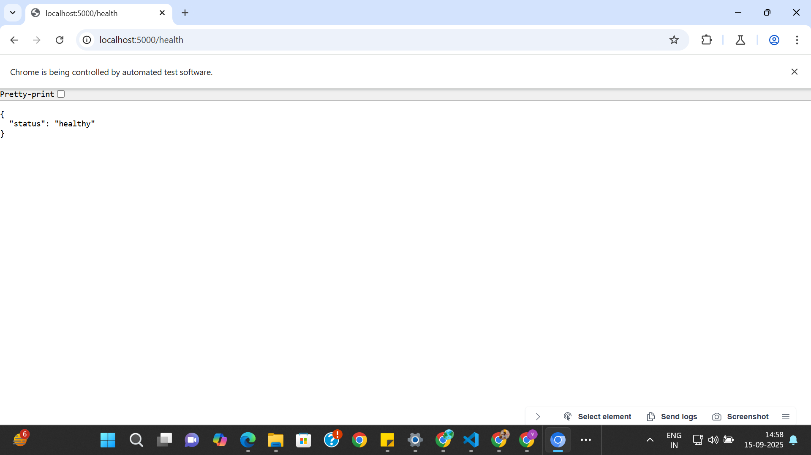
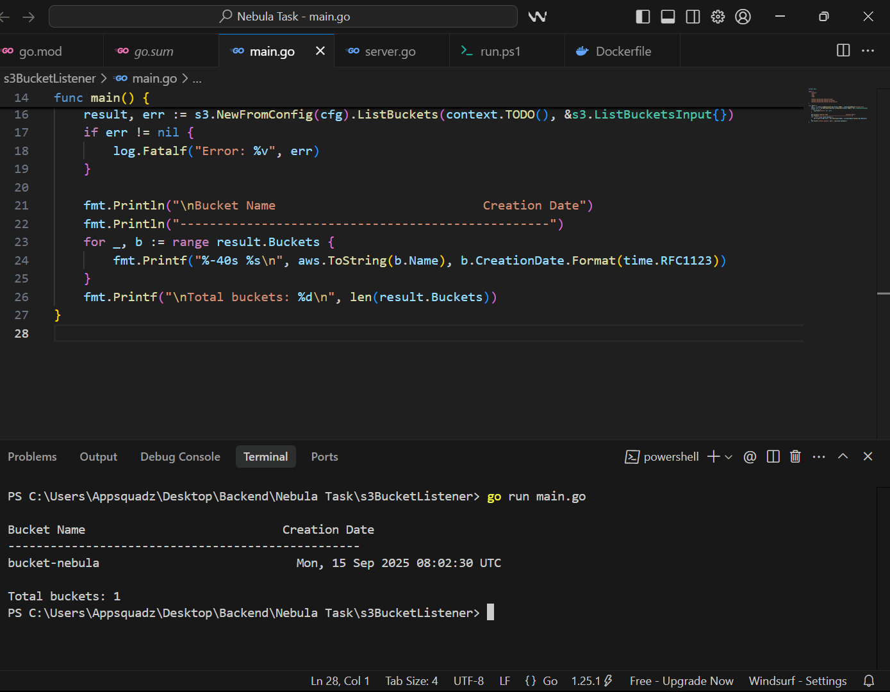
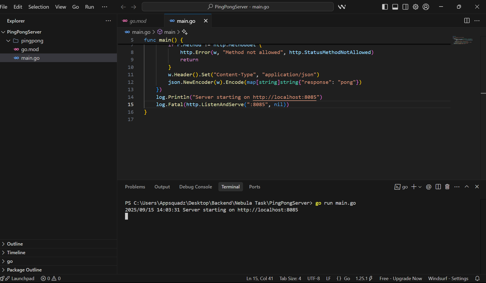
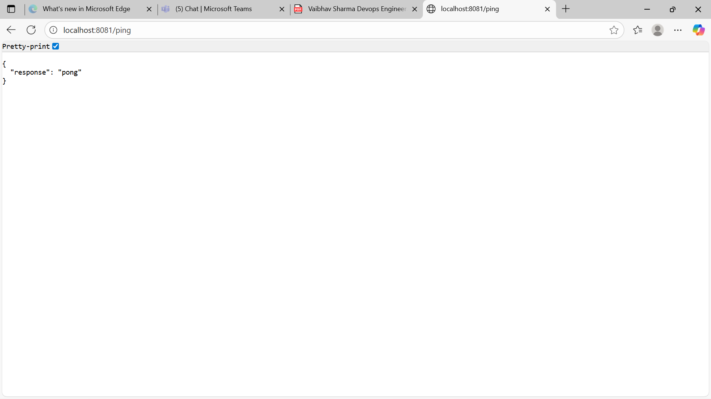
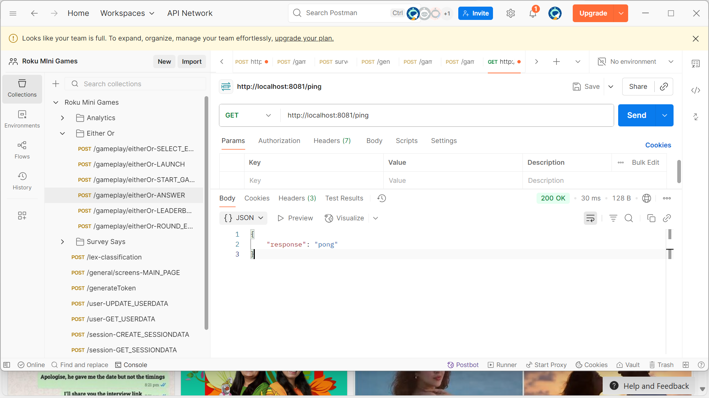

# Nebula Assignment 
Fork or Take a pull of this repo .


## Assignment Tasks (Python & Go)

Python Assignments:

1. Write a Python script using Boto3 to list all EC2 instances in a region and highlight those with unencrypted EBS volumes.


# EC2 Reader

A Python script that lists all EC2 instances in a region and highlights any **unencrypted EBS volumes**.

---

## Requirements
- Python 3.7+  
- Boto3 (`pip install boto3`)  
- AWS credentials (via `aws configure`, env vars, or IAM role)  

---

## Usage
Clone the repo and run:


```bash
python ec2_encryption_checker.py

```


2. Write a Python script that monitors a directory for file changes and logs every change into a file with timestamps (basic file watcher).

# File Watcher

   ## 📋 Requirements
- Python 3.6+  
- [watchdog](https://pypi.org/project/watchdog/) library  

Install the dependency:
```bash
pip install watchdog
python file_watcher.py
```


3. Build a simple Python Flask API that returns health status (200 OK with JSON payload { "status": "healthy" }).
   # Flask Health Check API

A simple Python Flask API that returns the health status of the service.

---

## 🚀 Features
- Health check endpoint: `/health`
- Returns JSON: `{ "status": "healthy" }`
- HTTP status code: `200 OK`

---

## 📋 Requirements
- Python 3.6+  
- Flask library  

Install Flask:
```bash
pip install flask
python app.py
curl http://localhost:5000/health
```




# GO Assigments

1. Write a Go program that connects to AWS S3 and lists all buckets with their creation date.

# AWS S3 Bucket Lister (Go)

A simple Go program that connects to AWS S3 and lists all buckets along with their creation date.

---

## 🚀 Features
- Lists all S3 buckets in the configured AWS account
- Displays bucket name and creation date
- Shows total number of buckets

---

## 📋 Requirements
- Go 1.18+  
- AWS SDK for Go v2 (`github.com/aws/aws-sdk-go-v2`)  
- AWS credentials configured via:
  - `~/.aws/credentials`
  - Environment variables (`AWS_ACCESS_KEY_ID` / `AWS_SECRET_ACCESS_KEY`)  
  - IAM role (if running on EC2)

Install dependencies:
```bash
go get github.com/aws/aws-sdk-go-v2
go get github.com/aws/aws-sdk-go-v2/config
go get github.com/aws/aws-sdk-go-v2/service/s3
```
for Run 

```bash
go run main.go

```

Output Sample

```bash
Bucket Name                            Creation Date
--------------------------------------------------
my-first-bucket                        Mon, 15 Sep 2025 10:00:00 UTC
project-backups                        Tue, 01 Aug 2025 12:30:00 UTC

Total buckets: 2

```


2. (Optional alternative) Create a small Go HTTP server that responds to /ping with {"response":"pong"}.
# Go Ping Server

A minimal Go HTTP server that responds to `/ping` with a JSON payload.

---

## 🚀 Features
- Endpoint: `/ping`
- Method: `GET`
- Response: `{"response": "pong"}`
- Returns `405 Method Not Allowed` for other methods

---

## 📋 Requirements
- Go 1.18+  

---

## 🔧 Usage

1. Save the code as `main.go`.  
2. Run the server:
```bash
go run main.go

```






